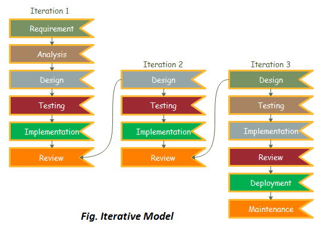
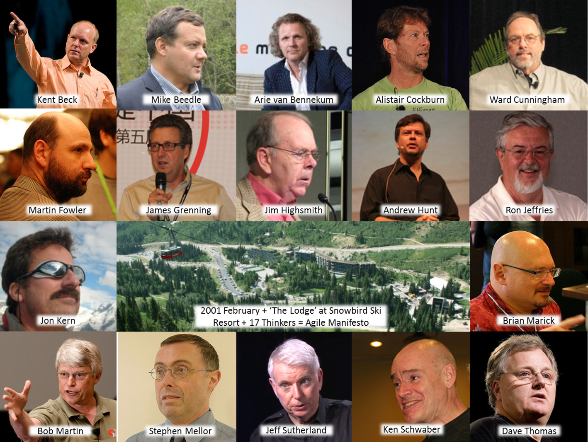
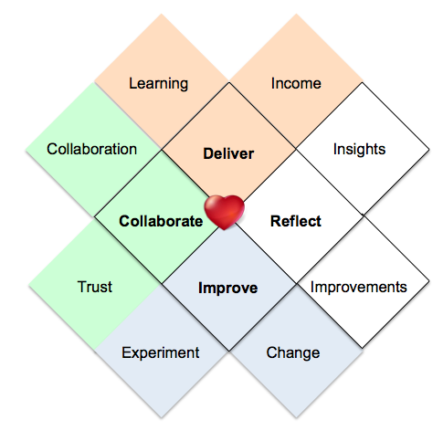

# Checkpoint

- [ ] SDLCs
- [ ] Flip coin game
- [ ] Traditional vs Agile
- [ ] Agile
- [ ] Heart of Agile

---

#### SDLC - Software Development Life Cycle

---

#### 1. Identify the Current Problems 

“What are the current problems?” 

---

#### 2. Plan

“What do we want?” 

---

#### 3. Design

“How will we get what we want?”

---

#### 4. Build

“Let’s create what we want.”

---

#### 5. Code + Test

“Did we get what we want?

---

#### 6. Software Deployment

“Let’s start using what we got.”

---

#### 7. Maintenance

“Let’s get this closer to what we want.”

---

### SDLC: Waterfall

---

### SDLC: Iterative

---

### SDLC: V-Model

---

### SDLC: Bigbang Model

---

### SDLC: Spiral Model (Incremental)

---

# Checkpoint

- [x] SDLCs
- [ ] Flip coin game
- [ ] Traditional vs Agile
- [ ] Agile
- [ ] Heart of Agile

---

# Checkpoint

- [x] SDLCs
- [x] Flip coin game
- [ ] Traditional vs Agile
- [ ] Agile
- [ ] Heart of Agile

---

### SDLC: Traditional

1. กำหนดสโคปของโปรเจค (3 อาทิตย์)
2. เก็บความต้องการของลูกค้า (2-3 เดือน)
3. ออกแบบซอฟต์แวร์ จัดทำเอกสาร (1 เดือน) 
4. เขียนโค้ด (~5 เดือน)
5. ทดสอบระบบ แก้ไขระบบ นำเอาระบบขึ้น (2-3 เดือน)

---

### Disruption

---

### The Disruptive Innovation Theory

---

### Iterative vs Incremental

---

### Iterative + Incremental = Agile

---

### Traditional vs Agile

---

### Traditional vs Agile

---

### Traditional vs Agile

---

# Checkpoint

- [x] SDLCs
- [x] Flip coin game
- [x] Traditional vs Agile
- [ ] Agile
- [ ] Heart of Agile

---

# Agile?
Agility a-gil-i-ty (noun) - **the power of moving quickly and easily;** nimbleness: exercises demanding agility. the ability to think and draw conclusions quickly; intellectual acuity.

---

### History of Agile

---

### Agile?

---

### Agile?

---

### Agile?

---

### Agile?

---

### Agile?

---

### Agile?

---

### Agile?

a set of **Values** and **Principles**

---

### Agile?

---

### Agile: 4 Core values

---

### Agile: 12 Principles

---

# Checkpoint

- [x] SDLCs
- [x] Flip coin game
- [x] Traditional vs Agile
- [x] Agile
- [ ] Heart of Agile
- [ ] Modern Agile

---

### Heart of Agile

---

### Heart of Agile

---

### Modern Agile

---